# MauiApp with RAG's AnyThingLM

This app is designed to use LM Studio with AnythingLLM, allowing an AI to search and retrieve information from the documents you upload to the RAG system.

## Instalation dependences

So for this proyect you will need two software that before I have indicated you. 
- <details open>
    <summary>
        <a href="https://lmstudio.ai/">LMStudio</a>
    </summary>

    When you download LM Studio on your device, you will be able to start the setup steps.

    1. First of all, if you want to load a small IA model, you will need to go the last option of
    the left vertical menu named ```Discover```
    
        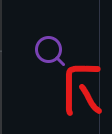

    2. Search in the bar for example ```llama-3.2-1b-instruct```, when you select
    the model clicked in download button.
    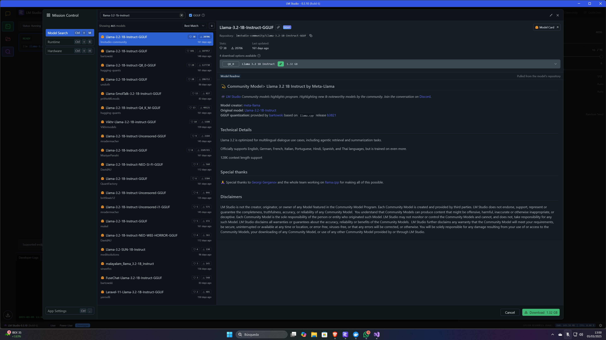

    3. When you download the model, to load the model downloaded you will click
    in the option above <br>```Select a model to load``` and click in ```Load model```
    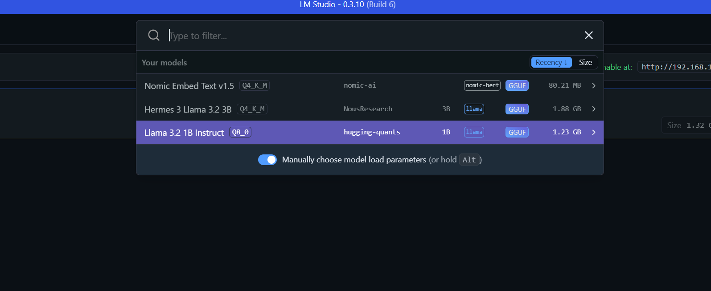

    4. You need to put your LMStudio in server mode and you can do it,
    clicking in the second option of the left vertical menu named ```Developer```
    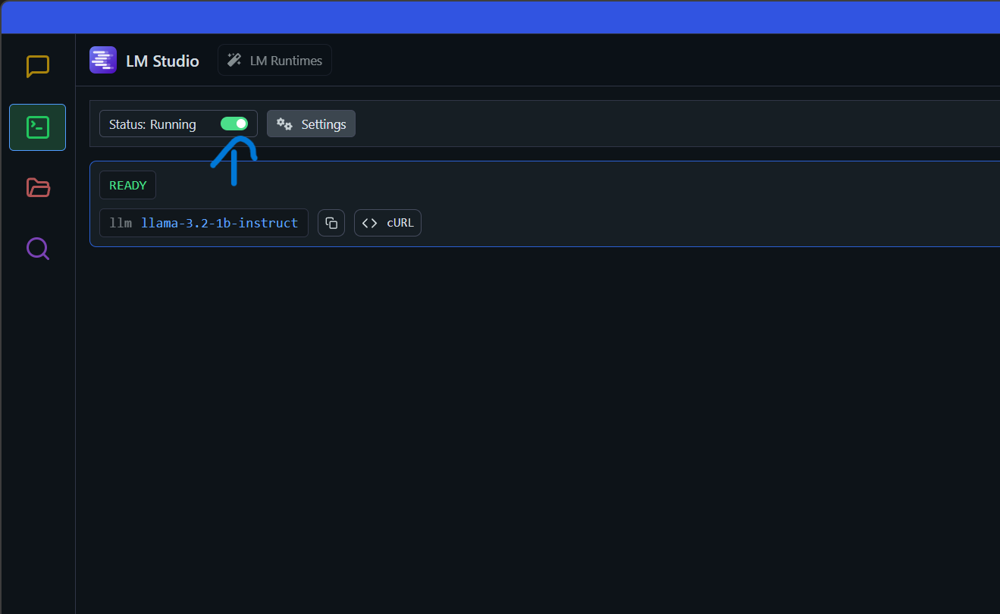

    5. Finally, you need to activate in ```settings``` the first option ```serve on local network```
    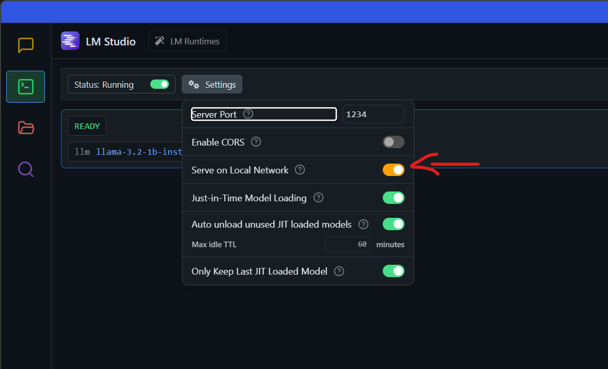
    
</details>

- <details open> 
    <summary>
        <a href="https://anythingllm.com/">AnyThingLLM</a>
    </summary>
    
    When you download AnyThingLLM on your device, you will be able to start the setup steps.

    - <details open> 
        <summary>
            <b>IMPORTANT</b>
        </summary>

        <b>¡For this step it is very important don't have open AnyThingLLM!</b>

        1. Before, you start to prepare AnyThingLLM, you will need to go to this PATH in your file explorer:
        `C:\Users\your_username\AppData\Local\Programs\AnythingLLM\resources\backend`. Make click in `server.js`
        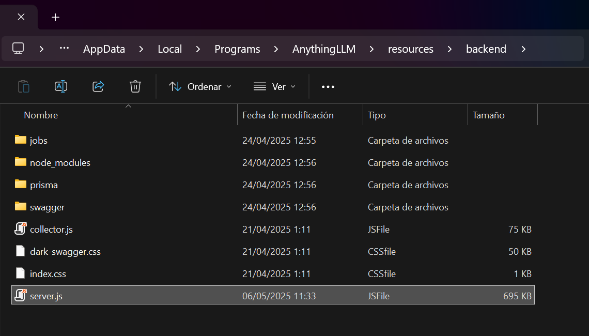

        2. Open in Visual Studio and use keyboard shortcut `Ctrl+F`, string to search indicate `127.0.0.1` 
        and for replace `0.0.0.0`. You will replace 5 references.
        
        3. When the change is done close everything and you open AnyThingLLM. Later you go 
        to your browser put the ip of your device and the path to go to AnyThingLLM Swagger API.
        Like: http://YOUR_IP:3001/api/docs
        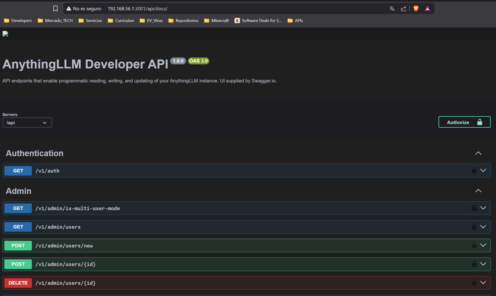


      </details>

    1. First of all, during the installation you will arrive a step what, you will need to
    indicate your `LLM Providers` and you will put `LM Studio`, When you will
    select `LM Studio` how LM provider will indicate in field **LM Studio Model** the model
    that you selected.
    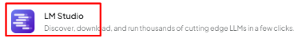

    2. After you have setuped and installed AnyThingLLM, you will go to configurations and
    select LM preference and you should see your LM provider and LM Studio model selected. Check
    it is everything okey.
    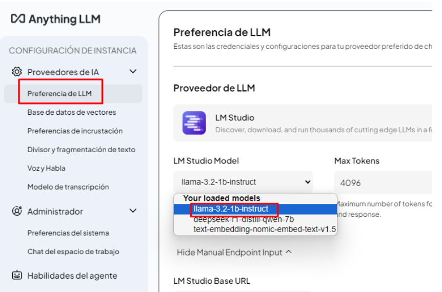

    3. Go to your workspace settings that you have created go to `chat configuration`.
    You will indicate **query** in `chat mode` and translate the prompt to your
    language.

    4. You will go to configuration (the botton last option of the left bar), click
    in `Tools` section and go to `API KEY`. Create a new API KEY to have api autorization.
    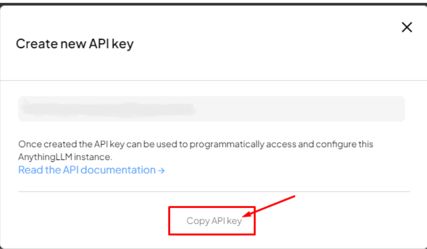

    5. Finally, when you start the app you will put your API KEY in settings to
    start the conection the AnyThingLLM
    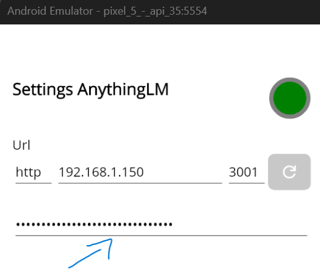

</details>